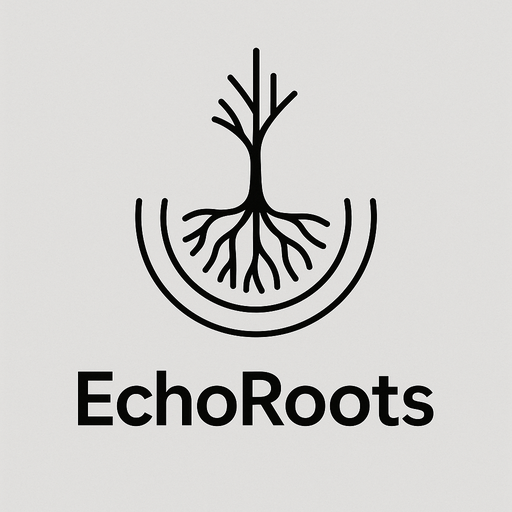

# EchoRoots



> **EchoRoots** 是一個知識驅動的資料治理與分類系統。
> 目標是將輸入的原始資料（如商品分類、文本知識庫）逐步轉換為可治理、可檢索的結構化知識，並支援 **Taxonomy、Attributes、Semantic Search** 的完整工作流程。  
**註:本專案開發中**
---

## 特色

* **多層次架構**：結合 Taxonomy (T)、Normalized Attributes (N)、Domain Data (D)、Semantic Layer (S)
* **混合存儲模型**：DuckDB（表格）、Neo4j（圖形）、Qdrant（向量）
* **可治理的工作流**：以 W1\~W6 六大流程，涵蓋初始化、回填、新流入、擴充提案、維護、語意治理
* **可擴充 LLM 應用**：在相應流程引入 LLM，輔助分類、歸一化、提案生成等
* **輕量可攜**：採用 DuckDB、Qdrant、Neo4j，本地或雲端皆可部署

---

## 專案結構

```
echo-roots/
├─ README.md
├─ .env.example                   # 環境變數範例
├─ data/                          # 測試資料（Parquet/JSON）
│  └─ {domain}/{table}/dt=YYYY-MM-DD/batch_id={id}/...
├─ duckdb/                        # 本地 DuckDB 檔與初始化 SQL
│  ├─ db/echo_roots.duckdb
│  └─ init/00_init.sql
├─ neo4j/                         # Neo4j 初始化腳本
│  └─ init/00_init.cypher
├─ qdrant/                        # Qdrant collections 規劃
│  └─ collections.md
├─ src/echo_roots/
│  ├─ models/                     # Pydantic 模型與欄位約定
│  ├─ workflows/                  # 各 Workflow 實作 (W1~W6)
│  ├─ semantic/                   # 向量化與語意模組
│  ├─ storage/                    # 儲存介面與抽象協定
│  └─ utils/                      # 共用工具
```

---

## 技術棧

* **核心儲存**

  * DuckDB → ingestion、統計分析
  * Neo4j → taxonomy 與屬性圖結構
  * Qdrant → 向量檢索與語意搜尋
* **Python 生態**

  * `pydantic`：資料模型驗證
  * `duckdb`, `neo4j`, `qdrant-client`
  * `rapidfuzz`：相似度比對
  * `regex`, `opencc`：文字處理
* **LLM / Embeddings**

  * Hugging Face 上的公開 embedding 模型（如 `sentence-transformers`）
  * 可選：vLLM / Gemini API / OpenAI embeddings

---

## Workflow 概覽

| Workflow    | 描述                    | 存取主要系統        |
| ----------- | --------------------- | ------------- |
| **W1 初始化**  | D→T/N 初稿建構            | DuckDB、Neo4j  |
| **W2 回填**   | 增量更新與補齊               | DuckDB        |
| **W3 新流入**  | 新資料進入 S 層             | DuckDB、Qdrant |
| **W4 擴充提案** | 新分類或屬性提案              | DuckDB        |
| **W5 維護**   | N/T/G 結構維護            | Neo4j、DuckDB  |
| **W6 語意治理** | 單節點治理（Dedup/Stats/提案） | DuckDB、Qdrant |

---

## 快速開始

1. **安裝依賴**

   ```bash
   curl -LsSf https://astral.sh/uv/install.sh | sh
   uv sync
   uv run pre-commit install
   ```

2. **初始化資料庫**

   ```bash
   duckdb -init duckdb/init/00_init.sql duckdb/db/echo_roots.duckdb
   ```

3. **啟動 Neo4j (Docker 範例)**

   ```bash
   docker run -d --name neo4j_test -p 7474:7474 -p 7687:7687 neo4j:5.26
   ```

4. **建立 Qdrant Collections**

   ```bash
   # 在 qdrant/collections.md 定義結構，使用 client 初始化
   ```

---

## Glossary

* **T**: Taxonomy（分類骨架）
* **N**: Normalized Attributes（受控屬性）
* **D**: Domain Data（來源資料）
* **S**: Semantic Layer（向量層）
* **OD**: Operational Data（運行資料）
* **G**: Governance Layer（治理狀態）

---
